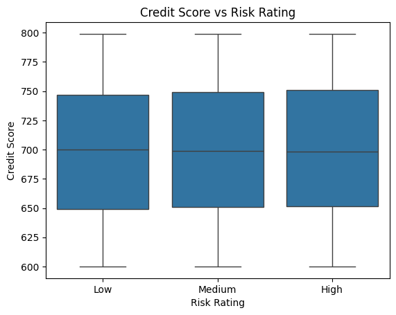
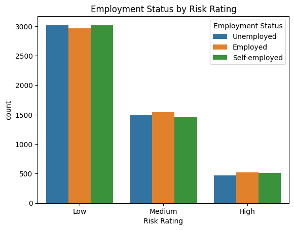
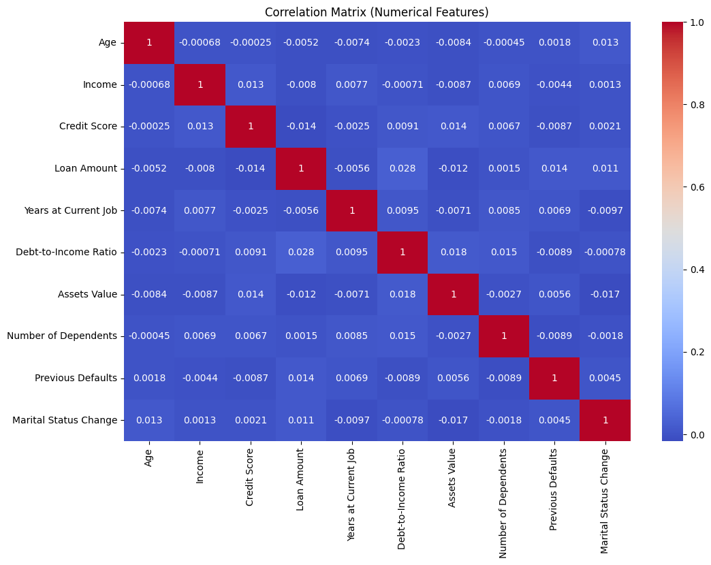
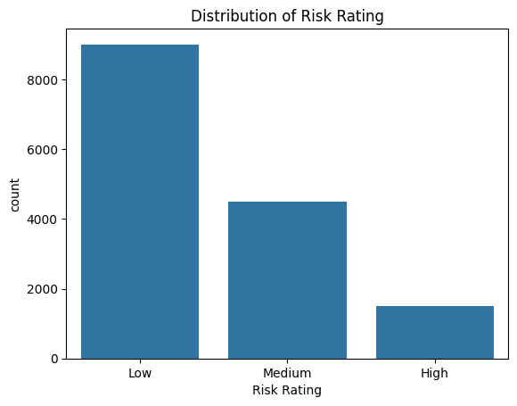

# Laporan Proyek Machine Learning - Siti Nurbayanah

## Domain Proyek

Sistem pemeringkatan risiko (risk rating) dalam industri keuangan sangat penting untuk membantu lembaga pemberi pinjaman dalam menilai kelayakan kredit calon peminjam. Risiko kredit yang tidak dikelola dengan baik dapat menyebabkan tingginya tingkat kredit macet (non-performing loan/NPL), yang berdampak buruk terhadap kestabilan keuangan lembaga.

Menurut laporan dari OJK (2023), peningkatan sistem pemeringkatan risiko berbasis data merupakan langkah strategis yang harus ditempuh lembaga pembiayaan untuk menurunkan risiko gagal bayar. Dengan menggunakan pendekatan Machine Learning, lembaga keuangan dapat memanfaatkan data historis nasabah untuk memprediksi potensi risiko secara lebih akurat dibandingkan metode tradisional.

Referensi:

- OJK. (2023). Laporan Perkembangan Keuangan Digital Indonesia.
- Breeden, J. (2020). "Credit Risk Scorecard: Development and Implementation". Wiley Finance Series.

## Business Understanding

### Problem Statements

- Bagaimana cara mengklasifikasikan risiko calon peminjam ke dalam kategori risiko tertentu (Risk Rating) berdasarkan data keuangan dan atribut calon peminjam?

### Goals

- Membangun model klasifikasi untuk memprediksi Risk Rating berdasarkan atribut calon peminjam.

### Solution Statements

- Menggunakan dan membandingkan 4 algoritma klasifikasi seperti XGBoost, Random Forest, Support Vector Machine, dan Naibve Bayes untuk membandingkan performa model.
- Menerapkan SMOTE (Synthetic Minority Oversampling Technique) untuk menangani ketidakseimbangan kelas pada data pelatihan.
- Mengukur performa model dengan metrik klasifikasi seperti F1 Score, Precision, dan Recall.

## Data Understanding

Dataset yang digunakan dalam proyek ini berasal dari platform Kaggle, diunggah oleh Preetham Gouda (https://www.kaggle.com/datasets/preethamgouda/financial-risk). Dataset ini memiliki **15.000 baris dan 20 kolom**, berisi informasi calon peminjam yang relevan untuk sistem pemeringkatan risiko keuangan.

### Kondisi Awal Data

Berdasarkan eksplorasi awal pada dataset (`.info()` dan `.isna().sum()`), ditemukan kondisi berikut:

- **Missing values** terdapat pada kolom-kolom:
  - Income                   2250
  - Credit Score             2250
  - Loan Amount              2250
  - Assets Value             2250
  - Number of Dependents     2250
- **Data duplikat**: Tidak ditemukan data duplikat (`df.duplicated().sum() = 0`)

### Deskripsi Variabel

Berikut adalah penjelasan seluruh fitur dalam dataset:

- **Gender**: Jenis kelamin peminjam (`Male`, `Female`)
- **Age**: Usia peminjam (numerik)
- **Education Level**: Tingkat pendidikan terakhir (kategorikal: `High School`, `Bachelor`, dll.)
- **Marital Status**: Status pernikahan peminjam (`Single`, `Married`, dll.)
- **Employment Status**: Status pekerjaan (`Employed`, `Self-employed`, dll.)
- **Income**: Total pendapatan tahunan (numerik, dalam satuan USD)
- **Credit Score**: Skor kredit (numerik)
- **Loan Amount**: Jumlah pinjaman yang diajukan (numerik)
- **Loan Purpose**: Tujuan dari pengajuan pinjaman (`Home`, `Car`, `Business`, dll.)
- **Debt-to-Income Ratio**: Rasio antara utang dan pendapatan (numerik)
- **Assets Value**: Total nilai aset (numerik)
- **Number of Dependents**: Jumlah tanggungan keluarga (numerik)
- **Previous Defaults**: Jumlah riwayat gagal bayar sebelumnya (numerik)
- **Payment History**: Riwayat keterlambatan pembayaran (numerik)
- **Years at Current Job**: Lama bekerja pada pekerjaan saat ini (dalam tahun)
- **City**: Kota tempat tinggal peminjam
- **State**: Negara bagian tempat tinggal
- **Country**: Negara tempat tinggal
- **Marital Status Change**: Perubahan status pernikahan (misal `Yes` jika pernah berubah)
- **Risk Rating**: Label target klasifikasi risiko (`Low`, `Medium`, `High`), kemudian diencode sebagai 0, 1, 2

### EDA Visualisasi

Visualisasi eksploratif dilakukan untuk memahami pola data, seperti:

- **Boxplot** antara Credit Score dan Risk Rating  
    
  Boxplot ini menunjukkan distribusi skor kredit (Credit Score) berdasarkan kategori risiko (Risk Rating) Low, Medium, dan High. Dari grafik terlihat bahwa rentang nilai skor kredit untuk ketiga kategori risiko tersebut hampir sama, dengan median sekitar 700 dan rentang antara 600 sampai 800. Hal ini mengindikasikan bahwa skor kredit saja tidak terlalu membedakan ketiga tingkat risiko secara signifikan dalam data ini.
- **Countplot** distribusi Risk Rating dan Employment Status  
    
  Grafik ini menampilkan grafik batang yang menggambarkan hubungan antara status pekerjaan dan tingkat penilaian risiko. Grafik menunjukkan bahwa sebagian besar individu—baik yang menganggur, bekerja, maupun wiraswasta—berada dalam kategori risiko rendah, dengan jumlah sekitar 3000 orang per status pekerjaan. Sementara itu, jumlahnya menurun pada kategori risiko sedang dan semakin berkurang pada kategori risiko tinggi, masing-masing sekitar 1500 dan 500 orang. Informasi dalam grafik ini bisa membantu memahami keterkaitan antara tingkat risiko dan kondisi ketenagakerjaan dalam suatu populasi.
- **Heatmap** korelasi antar fitur numerik  
    
  Hasil matriks korelasi tersebut menunjukkan bahwa semua fitur numerik dalam dataset memiliki korelasi yang sangat rendah atau hampir nol satu sama lain, dengan nilai korelasi berkisar sangat dekat dengan 0 kecuali diagonal utama yang bernilai 1 (korelasi sempurna dengan dirinya sendiri). Ini mengindikasikan bahwa tidak ada hubungan linear yang kuat atau signifikan antara variabel-variabel seperti usia, pendapatan, skor kredit, jumlah pinjaman, lama bekerja, rasio utang terhadap pendapatan, nilai aset, jumlah tanggungan, riwayat default, dan perubahan status pernikahan dalam data tersebut. Dengan kata lain, fitur-fitur ini cenderung independen secara linear satu sama lain.
- **Distribusi** Risk Rating  
    
  Grafik ini menunjukkan distribusi rating risiko dengan tiga kategori: Low, Medium, dan High. Terlihat bahwa mayoritas data berada pada kategori Low dengan jumlah hampir 9.000, diikuti oleh Medium sekitar 4.500, dan kategori High yang paling sedikit dengan jumlah sekitar 1.500. Ini mengindikasikan bahwa sebagian besar entitas dalam dataset memiliki risiko rendah, sementara risiko tinggi jauh lebih jarang terjadi.

## Data Preparation

Tahapan yang dilakukan:

1. **Penanganan Missing Values:**

   - Kolom numerik seperti Income, Credit Score, Loan Amount, Assets Value, Number of Dependents, dan Previous Defaults diimputasi menggunakan strategi median.
    Memberikan hasil:  

2. **Encoding:**

   - Kolom kategorikal diencode menggunakan LabelEncoder hal ini digunakan untuk merepresentasikan kolom kategorikal kde dalam angka, ini dilakukan agar dapat memudahkan pemodelan.
   - Kolom target `Risk Rating` juga diencode untuk keperluan klasifikasi.
   - Gambaran encoding:
    * `categorical_cols`: daftar kolom kategorikal yang akan dikodekan.
    * `LabelEncoder()` dari `sklearn.preprocessing` digunakan untuk mengubah setiap nilai unik pada kolom menjadi angka integer (misalnya: `Male` jadi `1`, `Female` jadi `0`).
    * `le.fit_transform(df[col].astype(str))`: memastikan semua nilai berupa string (menghindari error jika ada `NaN`) lalu mengubahnya jadi angka.
    * `label_encoders[col] = le`: menyimpan encoder untuk setiap kolom jika nanti perlu *inverse transform* (mengembalikan ke bentuk aslinya).
    * Target kolom `Risk Rating` juga diencode dengan encoder tersendiri (`le_target`).

3. **Feature Scaling:**

   - Sama halnya dengan kolom kategorikan, kolom numerikal juga harus dilakukan normalisasi. Normalisasi kolom numarik akan dilakukan menggunakan **MinMaxScaler** dari `sklearn.preprocessing`, yang mengubah nilai dalam setiap kolom numerik ke rentang antara **0 dan 1**. Berikut gambarannya:
      * `numeric_cols`: daftar nama kolom numerik yang akan dinormalisasi.
      * `MinMaxScaler()` membuat objek scaler yang akan menghitung nilai minimum dan maksimum tiap kolom.
      * `scaler.fit_transform(...)`: menghitung min dan max.
      * `df[numeric_cols] = ...`: hasil normalisasi ditimpa kembali ke DataFrame `df` pada kolom-kolom tersebut.
      * `print(df.head())`: menampilkan 5 baris pertama untuk memverifikasi hasil scaling.

4. **Train-Test Split dan SMOTE:**

   - Selanjutnya adalah splitting data. Di tahap ini kita kita memisahkan fitur `X` dan target `y` dari dataset, lalu membagi data menjadi 80% training dan 20% testing dengan `random_state=42` dan `stratify=y` agar distribusi kelas target seimbang. Selanjutnya, menggunakan SMOTE (`random_state=42`) untuk melakukan oversampling pada data training sehingga kelas minoritas diperbanyak secara sintetis agar model tidak bias terhadap kelas mayoritas.

## Modeling

Dalam proyek ini, empat algoritma klasifikasi digunakan dan dibandingkan untuk memprediksi `Risk Rating`. Berikut adalah deskripsi cara kerja masing-masing algoritma beserta parameter yang digunakan:

### 1. Random Forest Classifier

**Cara Kerja:**  
Random Forest adalah model berbasis ensemble yang membangun banyak pohon keputusan (decision trees) selama pelatihan dan menggabungkan hasilnya untuk meningkatkan akurasi prediksi dan mengurangi overfitting. Setiap pohon dilatih pada subset data dan subset fitur secara acak.

**Parameter Utama:**

- n_estimators=200,
- max_depth=10,
- min_samples_leaf=5
- class_weight='balanced'
- random_state=42

### 2. XGBoost Classifier

**Cara Kerja:**  
XGBoost adalah model boosting berbasis pohon yang membangun model secara bertahap dengan meminimalkan kesalahan model sebelumnya. XGBoost menggunakan regularisasi untuk menghindari overfitting.

**Parameter Utama:**

- class_weight='balanced'
- eval_metric='mlogloss'
- random_state=42
- sample_weight=sample_weights

### 3. Support Vector Machine (SVM)

**Cara Kerja:**  
SVM bekerja dengan mencari hyperplane optimal yang memisahkan kelas dalam ruang fitur. Untuk data non-linear, kernel trick digunakan untuk memproyeksikan data ke dimensi lebih tinggi agar dapat dipisahkan.

**Parameter Utama:**

- kernel='rbf'
- C=1
- decision_function_shape='ovr'
- probability=True

### 4. Naive Bayes (GaussianNB)

**Cara Kerja:**  
Model ini mengasumsikan bahwa fitur bersifat independen dan mengikuti distribusi normal. Meskipun sederhana, model ini efektif dalam klasifikasi berbasis probabilistik.

**Parameter Utama:**

- Menggunakan parameter default dari GaussianNB().

Model terbaik dipilih berdasarkan nilai akurasi pada data uji.

## Evaluation

Metrik yang digunakan:

- **Accuracy**: Proporsi prediksi yang benar
- **Precision**: Ketepatan prediksi positif
- **Recall**: Kemampuan model menemukan semua sampel positif
- **F1 Score**: Harmonik rata-rata Precision dan Recall

Dari hasil evaluasi keempat model pada data uji, terlihat perbedaan performa yang cukup signifikan:

- **XGBoost (XGB)** memiliki akurasi tertinggi sekitar 55%, dengan performa terbaik pada kelas 1 (precision 0.60, recall 0.84, f1-score 0.70). Namun, kelas 0 dan 2 memiliki performa rendah, terutama kelas 0 dengan recall hanya 0.02, yang berarti hampir sebagian besar sampel kelas 0 salah diklasifikasikan. Confusion matrix menunjukkan model ini sering salah mengklasifikasikan kelas 0 dan 2 sebagai kelas 1.

- **Random Forest (RF)** akurasinya lebih rendah, sekitar 52%. Sama seperti XGB, model ini juga lebih baik dalam mengenali kelas 1 (recall 0.81), tapi performa kelas 0 dan 2 masih lemah, terutama kelas 2 dengan recall hanya 0.06. Confusion matrix memperlihatkan banyak kesalahan klasifikasi kelas 0 dan 2 ke kelas 1.

- **SVM** memiliki akurasi paling rendah, hanya sekitar 26%. Model ini cenderung salah memprediksi kelas 1 dan 2 dengan sangat tinggi (banyak sampel kelas 1 salah diklasifikasikan ke kelas 0 dan 2, serta kelas 2 sering salah prediksi). Recall untuk kelas 1 sangat rendah (0.14), yang artinya SVM kesulitan mengenali kelas mayoritas ini. Namun, recall kelas 0 dan 2 relatif lebih baik dibanding kelas 1, menunjukkan bias yang berbeda dari model pohon.

- **Naive Bayes (NB)** punya akurasi 42%, performanya seimbang tapi relatif rendah di semua kelas. Recall kelas 1 masih moderat (0.57), tapi kelas 0 dan 2 masih rendah (0.19 dan 0.21). Model ini juga sering salah memprediksi kelas 0 dan 2 ke kelas 1, mirip dengan pola pada model pohon.

**Kesimpulan:**
Model XGBoost menunjukkan performa terbaik dalam mengenali kelas mayoritas (kelas 1), tapi semua model masih mengalami kesulitan signifikan dalam mengklasifikasikan kelas minoritas (kelas 0 dan 2), yang mungkin disebabkan oleh ketidakseimbangan data atau fitur yang kurang informatif. SVM tampaknya tidak cocok dengan distribusi data ini karena akurasi dan recall kelas mayoritas sangat rendah. Perlu usaha lebih lanjut seperti tuning hyperparameter, teknik penyeimbangan data yang lebih efektif, atau fitur engineering untuk meningkatkan performa model terutama pada kelas minoritas.
Model XGBoost dipilih karena memberikan hasil evaluasi yang lebih baik pada data uji dan mampu menangani ketidakseimbangan kelas dengan baik.

## Testing dengan Data Baru

Selanjutnya adalah melakukan testing dengan data baru. Pada testing, kode akan memproses dan memprediksi status pinjaman dari tiga data calon peminjam menggunakan empat model Machine Learning: **XGBoost**, **Random Forest**, **Support Vector Machine (SVM)**, dan **Naive Bayes**, yang telah dilatih sebelumnya. Data baru berupa informasi demografis dan keuangan seperti usia, pendapatan, nilai aset, skor kredit, dan status pekerjaan. Pertama, fitur kategorikal seperti *Gender* dan *Education Level* diubah menjadi angka menggunakan `LabelEncoder` yang sama saat training, dengan penanganan nilai yang belum pernah dilihat (`else -1`). Fitur numerik seperti *Income* dan *Loan Amount* distandarisasi menggunakan `StandardScaler` agar sesuai dengan distribusi data latih. Data yang telah diproses kemudian diurutkan mengikuti struktur fitur saat training (`X.columns`). Model XGBoost diprediksi menggunakan parameter default atau yang telah dituning sebelumnya (misalnya, `n_estimators`, `learning_rate`, dan `max_depth`), Random Forest kemungkinan menggunakan parameter seperti jumlah pohon (`n_estimators`) dan kedalaman maksimum pohon (`max_depth`), SVM menggunakan kernel tertentu (biasanya `'rbf'` atau `'linear'`), dan Naive Bayes menggunakan distribusi Gaussian karena data numerik. Output berupa prediksi label dari masing-masing model, yang ditambahkan sebagai kolom baru (`XGB Prediction`, `RF Prediction`, dll.) ke dalam dataframe untuk memudahkan perbandingan antar model.

Hasil testing menghasilkan output sebagai berikut:  

  

Hasil prediksi menunjukkan bahwa model **XGBoost** dan **Random Forest** konsisten memprediksi ketiga peminjam memiliki risiko pinjaman **"Low"**, yang mengindikasikan model ini menilai profil keuangan dan histori mereka cukup layak untuk pinjaman. Sebaliknya, model **SVM** secara keseluruhan memprediksi ketiganya sebagai **"High"** risk, kemungkinan karena sensitivitas SVM terhadap distribusi data yang membuatnya lebih konservatif terhadap variasi tertentu. Sementara itu, model **Naive Bayes** menghasilkan prediksi yang lebih bervariasi: satu peminjam diprediksi **"Medium"** dan dua lainnya **"Low"**, menunjukkan model ini lebih dipengaruhi oleh probabilitas fitur-fitur tertentu secara independen. Perbedaan ini mencerminkan bagaimana masing-masing algoritma menangani kompleksitas dan interaksi fitur dalam menentukan tingkat risiko pinjaman.
